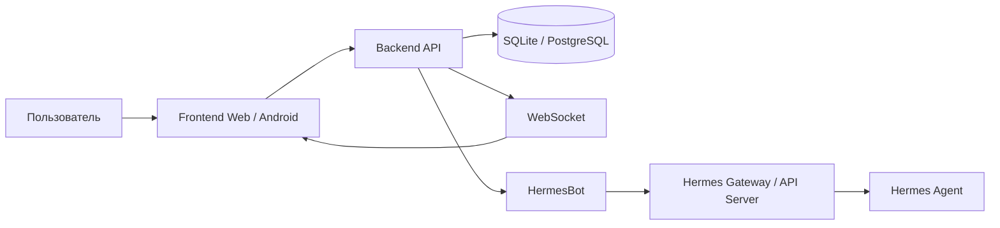
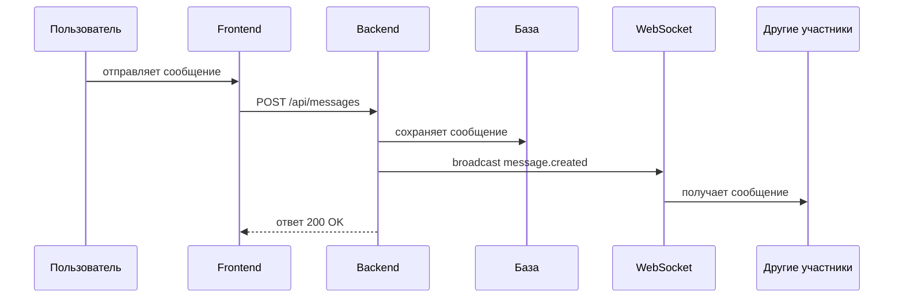
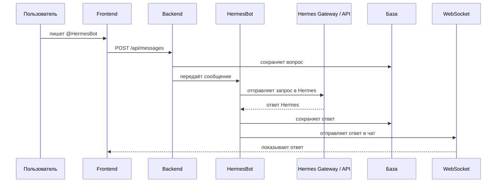

# Архитектура Hermes Messenger

## Цель

Сделать мессенджер наподобие Telegram:

- личные чаты;
- группы;
- каналы;
- боты;
- история сообщений;
- уведомления;
- мобильный интерфейс;
- подключение Hermes как AI-бота.

## Общая схема



## Рекомендуемый стек

### Frontend

Для первой версии:

- HTML;
- CSS;
- JavaScript;
- адаптивный мобильный интерфейс.

Позже можно добавить:

- PWA;
- Capacitor Android APK;
- уведомления.

### Backend

Рекомендуемый стек:

- Node.js;
- Express;
- WebSocket;
- SQLite для MVP;
- PostgreSQL при росте нагрузки.

### Хранение

Для MVP:

- SQLite;
- простая авторизация;
- локальные файлы для аватаров и вложений.

Для production:

- PostgreSQL;
- S3/MinIO для файлов;
- Redis для очередей и кэша;
- HTTPS reverse proxy.

## Основные модули

```txt
Frontend
├─ экраны чатов
├─ экран групп
├─ экран каналов
├─ экран ботов
├─ экран профиля
└─ экран настроек

Backend
├─ REST API
├─ WebSocket
├─ авторизация
├─ база данных
├─ файловое хранилище
├─ бот-сервис
└─ Hermes-прокси

Bots
├─ HermesBot
├─ WeatherBot
├─ NewsBot
└─ AdminBot
```

## Типы чатов

| Тип | Описание |
|---|---|
| Личный чат | 1 на 1 между пользователями |
| Группа | Несколько участников, общий поток сообщений |
| Канал | Администратор пишет, остальные читают |
| Бот-чат | Чат с HermesBot или другим ботом |
| Системный чат | Уведомления системы, ошибки, статусы |

## Сущности

```txt
User
Chat
ChatMember
Message
Bot
BotCommand
Session
FileAttachment
```

## Поток сообщения



## Поток Hermes-сообщения



## Почему Hermes нельзя подключать напрямую из браузера

Нельзя делать так:

```txt
Frontend → Hermes API с токеном
```

Почему:

- токен окажется в JavaScript;
- любой пользователь сможет его украсть;
- можно получить доступ к Hermes;
- сложно контролировать лимиты и права.

Правильно:

```txt
Frontend → Backend → Hermes
```

Backend хранит ключи, проверяет пользователя, ставит лимиты и пишет ответ в чат.

## Этапы реализации

| Этап | Что делаем | Результат |
|---|---|---|
| 1 | План и архитектура | Готовая структура проекта |
| 2 | Mock-MVP frontend | Рабочий интерфейс без backend |
| 3 | Backend API | Реальные пользователи и сообщения |
| 4 | WebSocket | Сообщения в реальном времени |
| 5 | Groups/channels | Группы и каналы |
| 6 | Bots | Боты и команды |
| 7 | HermesBot | Подключение к Hermes |
| 8 | APK | Android-версия |
